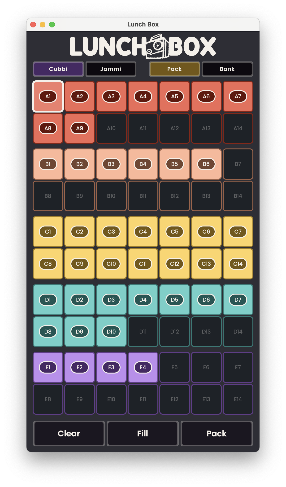
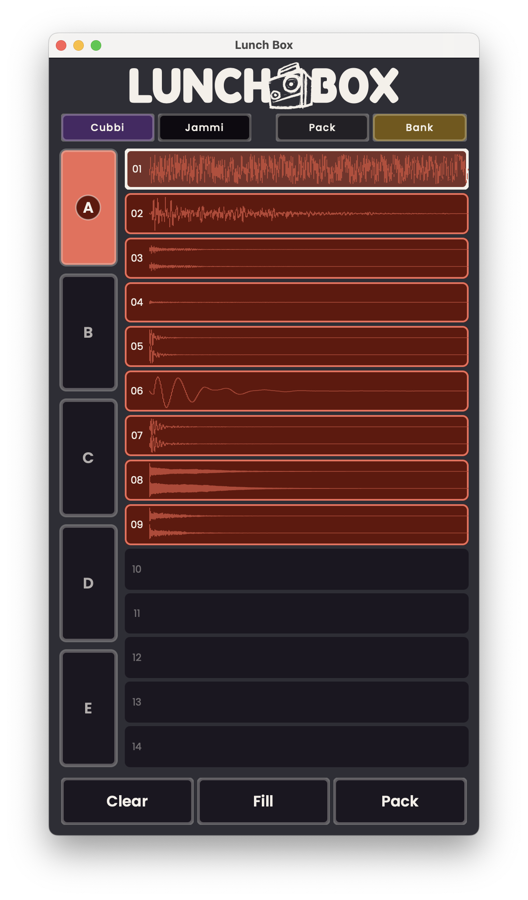
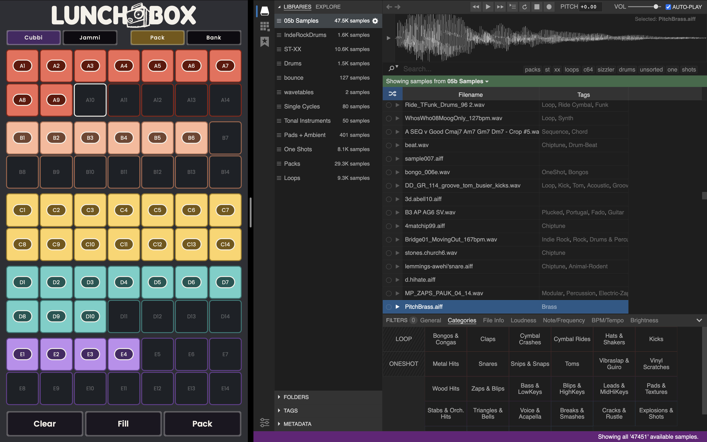

**Audio sample processor for the CHOMPI sampler**

Lunch Box is a dual-mode (GUI + CLI) application that converts audio files to
CHOMPI-compatible format (16-bit 48kHz WAV) and organizes them using the CHOMPI
naming convention.

[](LICENSE)

| Pack view | Bank view |
|-----------|-----------|
|  |  |

| Plays well with others — drag or paste samples straight from Sononym, Finder, or any file browser |
|---------------------------------------------------------------------------------------------------|
|  |

---

## Features

- **Two GUI Modes** — Pack (5-bank x 14-slot grid), Bank (single-bank focus view)
- **CLI Support** — Full command-line interface for scripting and automation
- **Format Support** — WAV, AIFF, MP3, FLAC input
- **CHOMPI Bank Assignment** — Automatic bank/slot organization with bank-subfolder detection
- **Dual Categories** — Process Cubbi (percussive) and Jammi (chromatic) samples independently
- **Waveform Preview** — Click-to-play preview. Waveform previews in bank mode
- **Drag and Drop** — Drag folders or individual files directly onto slots
- **Peak Normalization** — Samples normalized to -6 dB on export (on by default; `--no-normalize` in CLI)
- **Background Export** — Conversion runs off the UI thread; the window stays responsive and exports can be cancelled
- **Undo / Redo** — 10-step history across all view modes
- **Keyboard Navigation** — Full keyboard control (Cmd+Z/C/X/V/A, arrows, Tab, Space, Enter)
- **Safe Operations** — Never modifies original files

---

## Latest Release

[Lunch Box 1.1](https://github.com/mattfromatlanta/lunch_box/releases/tag/v1.1.0)

_Compiled for macOS and tested for Sequoia 15.7.3_

See [CHANGELOG.md](CHANGELOG.md) for release history.

---

## Developer Quick Start

### Prerequisites

- C++17 compiler (Clang on macOS, GCC/Clang on Linux, MSVC on Windows)
- CMake 3.22+
- [JUCE](https://github.com/juce-framework/JUCE) 8.0.12+

### Build

```bash
git clone https://github.com/mattfromatlanta/lunch_box.git
cd lunch_box

# Clone JUCE alongside the repo (or pass -DJUCE_DIR=/path/to/JUCE to cmake)
git clone --branch 8.0.12 --depth 1 https://github.com/juce-framework/JUCE.git ../JUCE

mkdir -p build && cd build
cmake ..
make
```

### Run (macOS)

```bash
open "build/lunch_box_artefacts/Lunch Box.app"
```

### CLI Mode

```bash
"build/lunch_box_artefacts/Lunch Box.app/Contents/MacOS/Lunch Box" \
  --cubbi /path/to/cubbi/samples \
  --jammi /path/to/jammi/samples \
  --output /path/to/output

# Shorthand flags
lunch_box --c /path/to/cubbi --j /path/to/jammi --o /path/to/output

# Help
lunch_box --help
```

---

## CHOMPI Sampler Overview

CHOMPI has two firmwares: **TAPE**, the signature five-bank sampler workflow, and
**TEMPO**, a groovebox-style firmware with its own sample architecture. **Lunch Box
supports and is tested against the TAPE firmware**; TEMPO support is planned for 1.2
(see [ROADMAP.md](ROADMAP.md)).

Under TAPE, CHOMPI organizes samples into two categories, each with five banks (A-E)
of 14 slots — 70 samples per category.

| Category | Use |
|----------|-----|
| **Cubbi** | Percussive, one-shots, loops, SFX |
| **Jammi** | Tuned/chromatic samples |

### Naming Convention

```
cubbi_a1.wav          # Cubbi, Bank A, Slot 1
jammi_e14.wav         # Jammi, Bank E, Slot 14
```

Lunch Box converts and renames each input sample to match the CHOMPI naming
convention so your library drops straight onto the hardware.

---

## Audio Specifications

|               | Input             | Output              |
|---------------|-------------------|---------------------|
| **Format**    | WAV, AIFF, MP3, FLAC | WAV              |
| **Bit depth** | Any               | 16-bit              |
| **Sample rate** | Any             | 48kHz               |
| **Channels**  | Mono / Stereo     | Preserved           |
| **Max duration** | 120 sec        | 120 sec             |
| **Level**     | Any               | -6 dB peak (normalization on by default) |

---

## Output Structure

```
output/
+-- cubbi_a1.wav          # Bank A, Slot 1
+-- cubbi_a2.wav
+-- ...
+-- cubbi_e14.wav         # Bank E, Slot 14
+-- jammi_a1.wav
+-- ...
```

One output file per input sample. Maximum 70 files per category.

---

## Project Structure

```
lunch_box/
+-- Source/
|   +-- Main.cpp                       # Entry point, GUI/CLI routing
|   +-- AudioConfiguration.h           # Shared config struct
|   +-- FileSystemHelper.h/cpp         # File utilities
|   +-- Logger.h/cpp                   # Timestamped logging
|   +-- CLI/
|   |   +-- CliProcessor.h/cpp         # CLI argument parsing
|   +-- GUI/
|   |   +-- Shell/                     # App window, main UI, menus, processing flow
|   |   +-- Pack/                      # Pack view: 5x14 grid per category
|   |   +-- Bank/                      # Bank view: single-bank waveform list
|   |   +-- Common/                    # Shared drag-and-drop model and controller
|   |   +-- Preview/                   # Waveform display + audio playback
|   |   +-- Style/                     # Colours, fonts, layout constants, UI strings
|   +-- Processing/
|       +-- LunchBoxProcessor.h/cpp    # Processing orchestrator
|       +-- AudioConverter.h/cpp       # Format conversion
|       +-- LunchBoxNamer.h/cpp        # CHOMPI naming + constants
|       +-- BankFolderParser.h/cpp     # Bank subfolder detection
+-- tests/                             # Unit tests (JUCE UnitTest framework)
+-- CMakeLists.txt
+-- README.md
+-- HOW_TO.md                          # Detailed user guide
+-- CHANGELOG.md                       # Release history
+-- CONTRIBUTING.md
+-- CODE_OF_CONDUCT.md
+-- LICENSE
```

---

## Logging

All operations are logged to timestamped files in the per-user log folder
(`~/Library/Logs/Lunch Box` on macOS):

```
lunch_box_log_YYYYMMDD_HHMMSS.txt
```

In the app, **Settings → Show Log Folder** opens it directly.

---

## Known Limitations

- **TAPE firmware only (for now).** Packs are built for CHOMPI's TAPE firmware
  (five banks, `cubbi`/`jammi` naming). The TEMPO firmware uses a different sample
  architecture — single bank, `chroma`/`slice` naming, 10-second maximum — and is
  planned for 1.2 (see [ROADMAP.md](ROADMAP.md)).
- **macOS is the supported platform.** The Linux build compiles in CI but is untested;
  Windows hasn't been tried. Clipboard import (paste files from Finder) is macOS-only.

---

## Contributing

Contributions are welcome. See [CONTRIBUTING.md](CONTRIBUTING.md) for details.

---

## License

GNU Affero General Public License v3.0 -- see [LICENSE](LICENSE) for details.

This project uses [JUCE](https://juce.com/), licensed under the AGPLv3.

This project uses the [Poppins](https://fonts.google.com/specimen/Poppins) typeface by The Poppins Project Authors, licensed under the [SIL Open Font License 1.1](fonts/OFL.txt).

This project uses the [Fredoka](https://fonts.google.com/specimen/Fredoka) typeface by The Fredoka Project Authors, licensed under the [SIL Open Font License 1.1](fonts/OFL-Fredoka.txt).

---

## Author

Made by **Matt from Atlanta**

- [GitHub](https://github.com/mattfromatlanta)
- [Bluesky](https://bsky.app/profile/mattfromatlanta.bsky.social)
- [Bandcamp](https://angsttanks.bandcamp.com/)

---

## Acknowledgements

- [JUCE Framework](https://juce.com/) -- cross-platform C++ application framework
- [CHOMPI](https://creditor.technology) -- the sampler hardware this tool is built for
